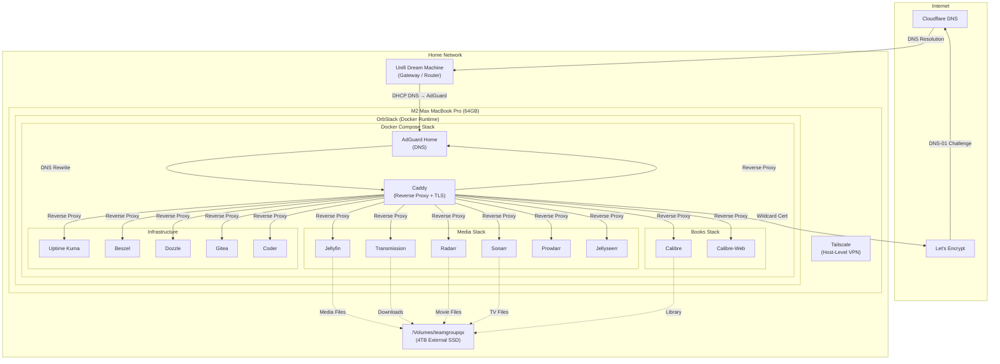
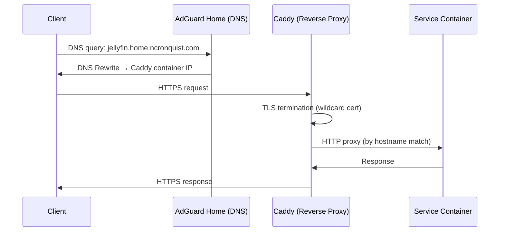
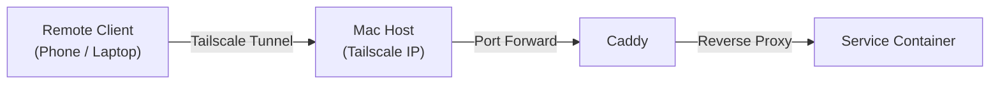

# Architecture

This document describes the overall architecture of the homelab, including how services are deployed, how traffic flows, and how storage is organized.

## System Overview



## Network Flow

A typical request flows through the following path:



### Step-by-step

1. **DNS Resolution** — Client queries AdGuard Home (set as the DHCP DNS server on the UDM). AdGuard has a DNS Rewrite rule: `*.home.ncronquist.com → <Caddy container IP>`.
2. **TLS Termination** — Caddy terminates TLS using a Let's Encrypt wildcard certificate for `*.home.ncronquist.com`, obtained via the DNS-01 challenge through the Cloudflare API.
3. **Reverse Proxy** — Caddy matches the `Host` header and proxies the request to the appropriate backend service container.
4. **Response** — The service responds through Caddy back to the client over HTTPS.

## HTTPS Strategy

All services are served over HTTPS using a **wildcard certificate** for `*.home.ncronquist.com`.

| Component | Role |
|-----------|------|
| **Let's Encrypt** | Certificate authority |
| **DNS-01 Challenge** | Validation method (no port 80 required) |
| **Cloudflare API** | DNS provider for challenge fulfillment |
| **Caddy** | Automatic certificate management and TLS termination |

The DNS-01 challenge is used instead of HTTP-01 because:

- It supports wildcard certificates (one cert for all subdomains)
- It doesn't require port 80/443 to be open to the internet
- The homelab is only accessible on the local network and via Tailscale

### Caddy Configuration

Caddy is configured with the `caddy-dns/cloudflare` plugin to automate certificate issuance and renewal. The Cloudflare API token is passed via environment variable.

## Storage Layout

Storage is split between the Mac's internal SSD and the external 4TB SSD:

### Internal SSD (macOS Filesystem)

```
docker/data/                    # Service configuration and runtime data
├── caddy/                      # Caddy config, certs
├── adguard/                    # AdGuard config, work dirs
├── jellyfin/                   # Jellyfin config, metadata cache
├── transmission/               # Transmission config
├── radarr/                     # Radarr config, database
├── sonarr/                     # Sonarr config, database
├── prowlarr/                   # Prowlarr config, database
├── jellyseerr/                 # Jellyseerr config, database
├── uptime-kuma/                # Uptime Kuma database
├── beszel/                     # Beszel data
├── dozzle/                     # Dozzle config (if any)
├── calibre/                    # Calibre config
├── calibre-web/                # Calibre-Web config
├── gitea/                      # Gitea data (repos, database)
└── coder/                      # Coder data
```

### External 4TB SSD (`/Volumes/teamgroupqx`)

```
/Volumes/teamgroupqx/
└── media/
    ├── movies/                 # Movie files (managed by Radarr)
    ├── tv/                     # TV show files (managed by Sonarr)
    ├── downloads/              # Transmission download directory
    │   ├── complete/
    │   └── incomplete/
    └── books/                  # Calibre library
```

> **Note**: The external SSD is not committed to the repo. Media files are considered disposable / re-downloadable. The Calibre library should be backed up separately.

## Tailscale

Tailscale runs at the **macOS host level** (not inside containers). This means:

- All containers are accessible via the Mac's Tailscale IP address
- No need for individual Tailscale containers per service
- DNS resolution still works via AdGuard Home (set as the Tailscale DNS)
- MagicDNS can optionally be used alongside local DNS

### Remote Access Flow



When accessing services remotely:

1. The remote device connects via Tailscale
2. DNS resolves `*.home.ncronquist.com` to the Mac's Tailscale IP (configured via Tailscale DNS or split DNS)
3. Traffic flows through Caddy for TLS termination and routing
4. Services are accessed identically to local access

## Domain Structure

All services are exposed under `*.home.ncronquist.com`:

| Subdomain | Service | Default Port |
|-----------|---------|-------------|
| `jellyfin.home.ncronquist.com` | Jellyfin | 8096 |
| `transmission.home.ncronquist.com` | Transmission | 9091 |
| `radarr.home.ncronquist.com` | Radarr | 7878 |
| `sonarr.home.ncronquist.com` | Sonarr | 8989 |
| `prowlarr.home.ncronquist.com` | Prowlarr | 9696 |
| `jellyseerr.home.ncronquist.com` | Jellyseerr | 5055 |
| `adguard.home.ncronquist.com` | AdGuard Home | 3000 (UI) |
| `status.home.ncronquist.com` | Uptime Kuma | 3001 |
| `beszel.home.ncronquist.com` | Beszel | 8090 |
| `logs.home.ncronquist.com` | Dozzle | 8080 |
| `calibre.home.ncronquist.com` | Calibre | 8083 |
| `books.home.ncronquist.com` | Calibre-Web | 8083 |
| `git.home.ncronquist.com` | Gitea | 3000 |
| `coder.home.ncronquist.com` | Coder | 7080 |

> **Note**: All services are accessed via HTTPS on port 443 through Caddy. The "Default Port" column refers to the container's internal port that Caddy proxies to.
