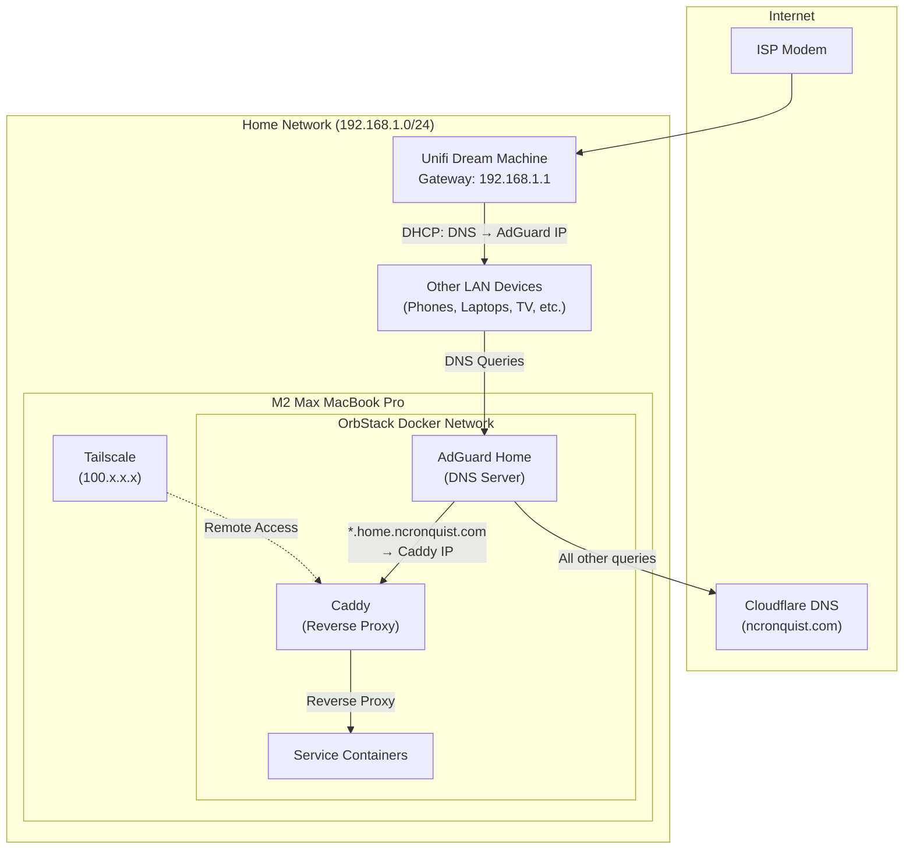
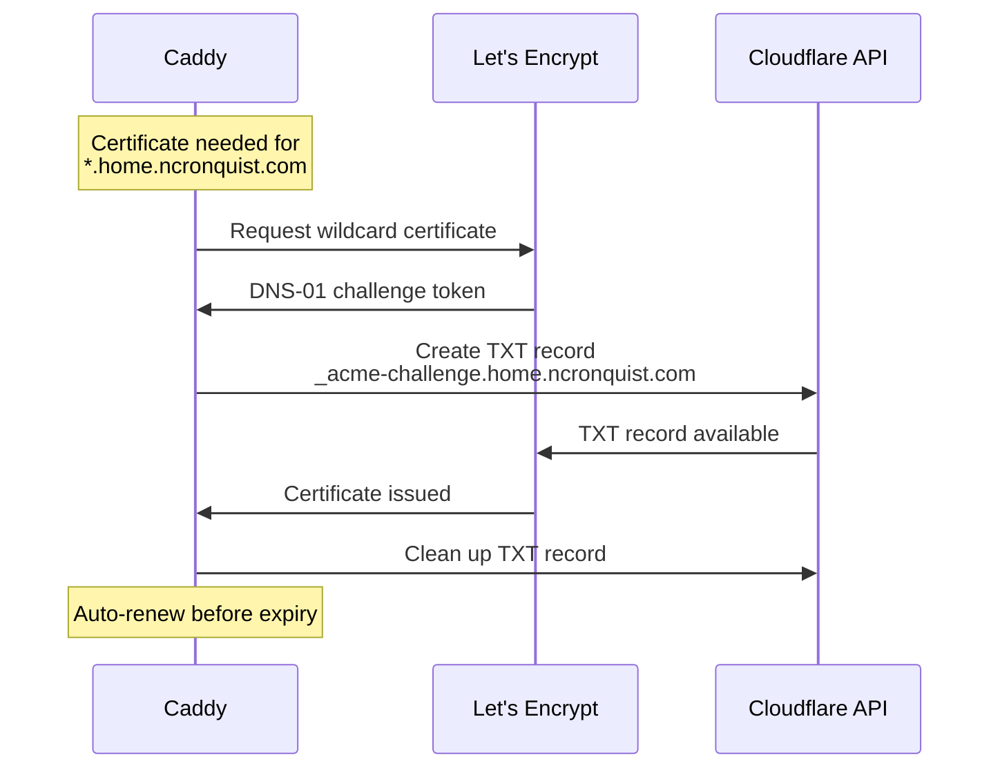

# Networking

This document describes the network topology, DNS configuration, and HTTPS strategy for the homelab.

## Network Topology



## DNS Chain

DNS resolution follows this chain:

### 1. UDM DHCP Configuration

The Unifi Dream Machine is configured to hand out **AdGuard Home's container IP** as the DNS server via DHCP. This ensures all devices on the LAN automatically use AdGuard for DNS.

| Setting | Value |
|---------|-------|
| DHCP DNS Server | `<AdGuard container IP>` |
| Gateway | `192.168.1.1` |

### 2. AdGuard Home DNS Rewrites

AdGuard Home is configured with a DNS Rewrite rule that catches all `*.home.ncronquist.com` queries and resolves them to Caddy's container IP:

| Rule | Target |
|------|--------|
| `*.home.ncronquist.com` | `<Caddy container IP>` |

For all other DNS queries, AdGuard forwards upstream to trusted resolvers (e.g., `1.1.1.1`, `9.9.9.9`).

AdGuard also provides:

- **Ad blocking** — Network-wide ad and tracker blocking
- **DNS query logging** — Full visibility into DNS activity on the network
- **Parental controls** — Optional content filtering

### 3. Cloudflare DNS (External)

The `ncronquist.com` domain is managed in Cloudflare. A wildcard DNS record is **not** required on Cloudflare for local resolution (AdGuard handles that internally). Cloudflare is used for:

- **DNS-01 challenge** — Caddy uses the Cloudflare API to prove domain ownership for Let's Encrypt wildcard certificate issuance
- **External DNS** — If any services are ever exposed to the internet (currently none are)

## HTTPS / TLS Termination

Caddy handles all TLS termination with automatic certificate management:



### Why DNS-01?

| Factor | HTTP-01 | DNS-01 |
|--------|---------|--------|
| Wildcard support | ❌ | ✅ |
| Requires open ports | Port 80 | None |
| Works behind NAT | ❌ | ✅ |
| Complexity | Low | Medium (API token) |

DNS-01 is the right choice because the homelab is behind a NAT, no ports are forwarded, and a wildcard cert covers all subdomains.

## Caddy Reverse Proxy

Caddy matches incoming requests by `Host` header and proxies to the appropriate backend:

```
*.home.ncronquist.com:443
    ├── jellyfin.home.ncronquist.com  → jellyfin:8096
    ├── transmission.home.ncronquist.com → transmission:9091
    ├── radarr.home.ncronquist.com    → radarr:7878
    ├── sonarr.home.ncronquist.com    → sonarr:8989
    ├── prowlarr.home.ncronquist.com  → prowlarr:9696
    ├── jellyseerr.home.ncronquist.com → jellyseerr:5055
    ├── adguard.home.ncronquist.com   → adguard:3000
    ├── status.home.ncronquist.com    → uptime-kuma:3001
    ├── beszel.home.ncronquist.com    → beszel:8090
    ├── logs.home.ncronquist.com      → dozzle:8080
    ├── calibre.home.ncronquist.com   → calibre:8083
    ├── books.home.ncronquist.com     → calibre-web:8083
    ├── git.home.ncronquist.com       → gitea:3000
    └── coder.home.ncronquist.com     → coder:7080
```

All containers share a Docker network, so Caddy references them by container/service name.

## Tailscale (Remote Access)

Tailscale runs on the macOS host (not inside containers). This provides remote access to all services without exposing anything to the public internet.

### How It Works

1. **Host-level Tailscale** — The Mac joins the Tailnet and gets a stable IP (e.g., `100.x.x.x`)
2. **DNS configuration** — Tailscale DNS (or split DNS) resolves `*.home.ncronquist.com` to the Mac's Tailscale IP when remote
3. **Same flow** — Remote requests hit Caddy just like local ones, going through TLS termination and reverse proxying

### Tailscale DNS Options

| Option | Description |
|--------|-------------|
| **Split DNS** | Configure `home.ncronquist.com` in Tailscale admin to resolve via AdGuard |
| **Override local DNS** | Set AdGuard as the global DNS in Tailscale |
| **Manual** | Add hosts entries on remote devices (not recommended) |

**Recommended**: Use Tailscale split DNS for `home.ncronquist.com` pointed at AdGuard's Tailscale-accessible IP.

## Future: VLANs

The Unifi Dream Machine supports VLANs, which could be used to segment the network in the future:

| VLAN | Name | Purpose |
|------|------|---------|
| 1 (default) | Trusted | Personal devices, homelab server |
| 10 | IoT | Smart home devices, cameras |
| 20 | Guest | Guest Wi-Fi |

### Considerations

- IoT devices would be isolated from the trusted network
- Firewall rules would control cross-VLAN traffic
- AdGuard Home would need to be accessible from all VLANs (or per-VLAN DNS)
- VLAN configuration would be managed via Terraform in the `networking/` project

> **Status**: VLANs are not currently configured. The entire network runs on a flat `192.168.1.0/24` subnet.
